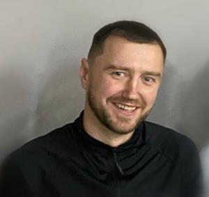

# BASOV EVGENI 

### contact with me 
📞 + 375 29 575 29 01    📨 basovevgeni2017@gmail.com    tg: @evgeni_jb

### **about myself**
> I'm an engineer based in Minsk ✊❤️✌️ with 1 years of experience in the IT industry. 
My focus area for the past years has been back-end development with Python, ETL process, ML, and analyze data. But I'm also skilled in HTML and CSS.

### **my experience**
* построение data warehouse с последующей аналитокой : в  мои обязаности входило разработать коннектор для загрузки данных  с api shopify woocoomers в бд, проектирование бд . (обеспечить бесперебойную поставку даннных и их хранение).
* система предсказания скидок: при помощь ml инструсентов построить систему которая выдавала бы прогноз скидок на текущую неделю , с учетом спроса , сезонности , остатков на складе, популярностью  моделели и др. параметров 
* волонтерский проект на word press: подключение плагинов, оптимизация сайта, настройка поиска
* разработка чат-ботов на платформе телеграм: разработка игр,ботов, деплой  на сервер 
* разработка  маркет-плейса: полный цикл разработки, составление тз, проектирование бд, разработка приложения. 
 	

